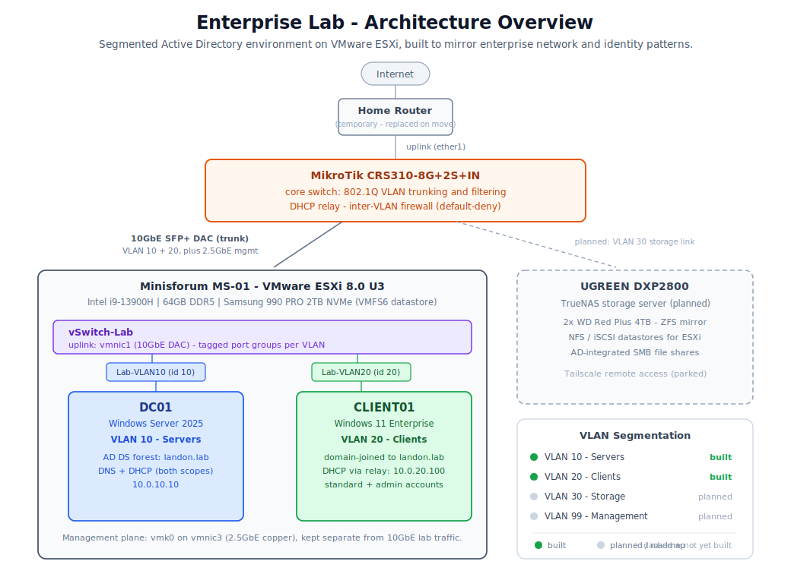

# Enterprise Active Directory Lab

A from-scratch enterprise IT lab: a segmented Active Directory network running on a Type-1 hypervisor, built on real hardware to develop and demonstrate hands-on skills for a junior systems administration and cybersecurity role.

This repository is the lab's living documentation - the architecture, dated build logs, and distilled reference notes, written as the lab is built and kept repo-ready as I go.

**Status:** active build, updated with each session.

## What this lab is

The goal is to simulate a small enterprise environment end to end - virtualization, centralized identity, segmented networking, and shared storage - and to document every decision as if handing the environment off to another administrator. Nothing here is click-through-a-tutorial: each layer is built deliberately, tested, and written up with the reasoning behind it.

It is the practical complement to a certification track (Security+ now, a cloud fundamentals cert next), and it is aimed squarely at the patterns that show up in real infrastructure and government / defense environments: least privilege, network segmentation, default-deny firewalling, and separation of the management plane from production traffic.

## Architecture

### Physical topology
The environment runs on a Minisforum MS-01 mini workstation acting as a single ESXi host, cabled through a MikroTik CRS310 switch. The layout is router, then switch, then server - the enterprise-realistic pattern where the switch is the core of the network rather than a passthrough. The host connects to the switch over a 10GbE SFP+ DAC carrying tagged VLAN traffic, with a separate 2.5GbE copper link reserved for management.

### Virtualization
VMware ESXi 8.0 U3 runs directly on the hardware. A dedicated virtual switch (vSwitch-Lab) carries lab traffic on the 10GbE uplink, with a tagged port group per VLAN, while host management stays on its own physical NIC. Getting ESXi stable on a hybrid P-core / E-core consumer CPU required specific kernel tuning, which is documented in the build logs.

### Identity - Active Directory
A Windows Server 2025 domain controller (DC01) hosts a new AD DS forest (landon.lab) and provides DNS and DHCP for the environment. A Windows 11 Enterprise client (CLIENT01) is domain-joined and managed centrally. User accounts follow an enterprise naming standard, with standard user accounts separated from dedicated administrative accounts to practice least privilege.

### Network segmentation
Traffic is separated into VLANs using 802.1Q tagging, enforced by bridge VLAN filtering on the MikroTik. Servers and clients live on different VLANs and cannot reach each other freely - inter-VLAN traffic is routed and then filtered by a stateful, default-deny firewall that permits only the specific Active Directory services clients require. A DHCP relay carries client DHCP requests across the VLAN boundary to the domain controller.

### Storage
A UGREEN DXP2800 NAS with mirrored drives is planned to run TrueNAS, providing ZFS-backed NFS / iSCSI datastores to ESXi over the 10GbE backbone and AD-integrated SMB shares. This layer is on the roadmap and not yet built (Waiting on 2x 4TB NAS Drives; WD Red Plus 5400 rpm)
## Component breakdown

| Layer      | Component                               | Role in the lab                                              |
| ---------- | --------------------------------------- | ------------------------------------------------------------ |
| Compute    | Minisforum MS-01 (i9-13900H, 64GB DDR5) | Single ESXi host                                             |
| Hypervisor | VMware ESXi 8.0 U3                      | Type-1 virtualization, virtual networking                    |
| Networking | MikroTik CRS310-8G+2S+IN                | VLAN trunking and filtering, DHCP relay, inter-VLAN firewall |
| Backbone   | 10GbE SFP+ DAC                          | Tagged VLAN uplink between switch and host                   |
| Identity   | Windows Server 2025 (DC01)              | AD DS forest, DNS, DHCP                                      |
| Client     | Windows 11 Enterprise (CLIENT01)        | Domain-joined, centrally managed endpoint                    |
| Storage    | UGREEN DXP2800 + 2x 4TB (ZFS mirror)    | TrueNAS shared storage (planned)                             |

## Built vs planned

**Built and validated**
- ESXi host installed and tuned for the hardware, with a datastore on dedicated NVMe.
- Virtual networking: dedicated vSwitch, per-VLAN tagged port groups, management traffic isolated on its own NIC.
- Active Directory forest (landon.lab) with DNS and DHCP.
- VLAN 10 (servers) and VLAN 20 (clients) segmented with 802.1Q, validated end to end.
- DHCP relay carrying client requests across the VLAN boundary.
- Domain-joined Windows 11 client, with the full join / rename / DNS-registration lifecycle.
- Standard and administrative user accounts following least-privilege separation.
- Stateful, default-deny inter-VLAN firewall permitting only required AD services.

**On the roadmap**
- VLAN 30 (storage) and VLAN 99 (management).
- TrueNAS on the NAS: ZFS-mirrored NFS / iSCSI datastores and AD-integrated SMB shares.
- AD Certificate Services / PKI on a dedicated member server.
- Remote access to the lab via Tailscale.
- Additional practice tracks: Server Core, Azure Arc.

## Skills this demonstrates

- Type-1 hypervisor deployment and virtual networking (ESXi, vSwitch, port groups, VLAN tagging).
- Active Directory design and administration built from the server side up (forest, DNS, DHCP, domain join, account and OU practices).
- Enterprise network segmentation: 802.1Q VLANs, trunking, DHCP relay, and stateful default-deny firewalling.
- Security fundamentals in practice: least privilege, management-plane separation, and service-scoped access control.
- Documentation-as-code: every build tracked in version control, written to be reproducible and sanitized for public sharing.

## Related work

A prior virtualized security lab (pfSense, Active Directory, Wazuh, and Suricata) included a documented Kerberoasting attack and detection walkthrough, focused on the blue-team / detection side of the same skill set.

## Repository layout

| Note | Contents |
|---|---|
| [Home.md](Home.md) | Single living status and checklist note |
| [Hardware](Hardware.md) | Every device: specs, quirks, fixes |
| [Roadmap](Roadmap.md) | Certification track and lab build phases |
| [Sessions/](Sessions/) | Dated build and troubleshooting logs |
| [Topics/](Topics/) | Distilled reference notes per concept |
| [Images/](Images/) | Architecture and concept diagrams |

This is an [Obsidian](https://obsidian.md) vault - clone it and open the folder as a vault for full wiki-link navigation, or just browse the Markdown here on GitHub.

## A note on sanitization

No credentials, keys, or internal identifiers are stored in this repository. Real addressing is replaced with placeholder ranges (VLAN 10 as 10.0.10.x, VLAN 20 as 10.0.20.x), and notes are written repo-ready rather than sanitized after the fact.
